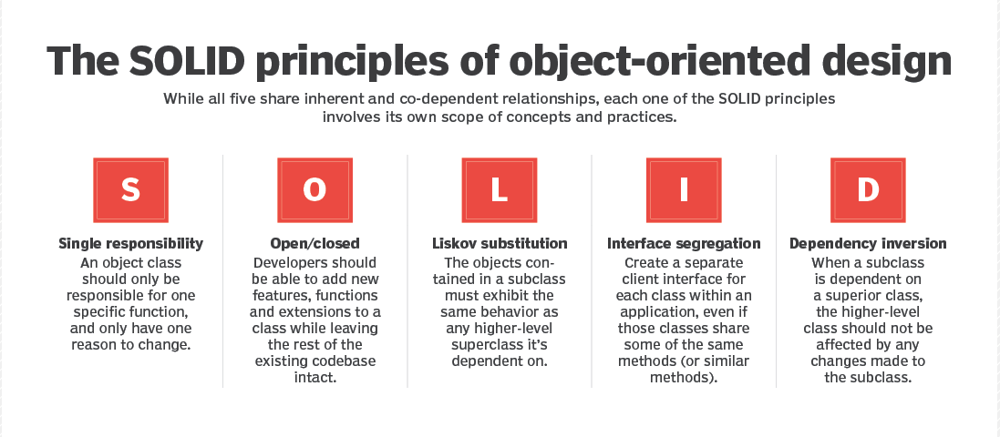

# SOLID

Five design principles, one folder each, every one shown as a **before** and an **after** you can run.

Each file opens with a one-sentence docstring naming the principle and what that particular file does
about it, so a file read on its own still explains itself.



## The five

| | Principle | What it says | How the fix works | The payoff |
| --- | --- | --- | --- | --- |
| **S** | Single Responsibility | A module has one reason to change — one audience that asks for edits | Split the routine along the seam between decisions: reshaping the data and rendering it become separate functions | Either step is reusable without dragging the other along, and a change to the output format cannot break the parsing |
| **O** | Open/Closed | Open to extension, closed to modification: add behaviour by adding code | Name the varying step as an abstract method, make each variant a subclass, and have the caller depend only on the abstraction | Adding a variant is a new class and zero edits to working code — new behaviour cannot regress old behaviour |
| **L** | Liskov Substitution | A subtype must keep every promise its base type makes | Move each promise down to the first type that can honestly keep it, so a base never declares more than every subtype delivers | Nothing has to stub a method it cannot perform, and code written against the base survives any subtype |
| **I** | Interface Segregation | No client depends on methods it does not call | Split a wide interface into one small role per capability, then compose the roles a given implementation actually has | A class declares only what it can do, so a test double implements one method instead of four |
| **D** | Dependency Inversion | Policy and detail both depend on an abstraction, and dependencies are handed in | Declare collaborators as abstractions and accept them as constructor arguments rather than constructing them inside | Swapping a real dependency for a fake is a change at the call site, so the class is testable without any infrastructure |

## The files

Every folder holds the same pair — `before.py` breaks the principle, `after.py` applies it.

| | Folder | The example |
| --- | --- | --- |
| **S** | [`S/`](S/) | Printing a currency table from the PrivatBank exchange-rate API |
| **O** | [`O/`](O/) | Sending a notification over email, SMS, Slack or Telegram |
| **L** | [`L/`](L/) | Backing a file up to several storage backends |
| **I** | [`I/`](I/) | A file store that may or may not support writing |
| **D** | [`D/`](D/) | Placing an order: persist it, then notify the customer |

Plus [`L/override.py`](L/override.py) — a second, subtler Liskov violation: the subclass keeps the
method but changes its **signature**.

## Running the examples

The folder is a flat set of standalone scripts managed by Poetry — no package, no `src/` layout,
nothing to build:

```bash
cd module01/solid

poetry install
poetry run python O/before.py
poetry run python O/after.py
```

Only [`S/before.py`](S/before.py) and [`S/after.py`](S/after.py) need the one dependency — they call
the PrivatBank API, so they want `requests` and a network connection. Everything under `O/`, `L/`,
`I/` and `D/` is pure stdlib and runs under a bare `python` just as well.

`pyproject.toml` declares `package-mode = false`, which tells Poetry to manage the environment and
skip the build step entirely.

---

## S — Single Responsibility

**Before** ([`S/before.py`](S/before.py)) — one function does two jobs. `pretty_view` first rebuilds
every record into a nested dict, then formats and prints the table. The author's own comment marks the
seam:

```python
# will I use it somewhere else?
```

That question is the principle. The reshaping step is useful on its own — for a CSV export, a test, a
different view — but it can't be reached without also printing.

**After** ([`S/after.py`](S/after.py)) — the two jobs become two functions:

```python
pretty_view(data_adapter(data))
```

`data_adapter` knows the API's shape and nothing about output; `pretty_view` knows the table layout and
nothing about where the data came from. Two reasons to change, two places to change them.

> **The mechanism:** plain functions. No classes are needed — SRP is about where the seams fall, not
> about object orientation.

---

## O — Open/Closed

**Before** ([`O/before.py`](O/before.py)) — one `send` method with a `match` over a `ServiceType`
enum. Adding Telegram means editing `Notifier.send`, editing the enum, and re-testing the channels
that already worked:

```python
match service:
    case ServiceType.EMAIL: ...
    case ServiceType.SMS: ...
    case ServiceType.SLACK: ...
```

**After** ([`O/after.py`](O/after.py)) — `Notifier` becomes an ABC with one abstract `send`, and each
channel is a subclass. `NotificationService` holds a list of them and calls `send` on each, knowing
nothing about which is which:

```python
class NotificationService:
    def __init__(self, notifires: list):
        self.notifiers = notifires

    def notify_all(self, message):
        for notifier in self.notifiers:
            notifier.send(message)
```

Adding a channel is now one new class. Nothing that already works gets edited, so nothing that already
works can regress.

Note `DesktopNotifier` — a subclass that adds no `send` of its own, existing only to group
`TelegramNotifier` and `SlackNotifier`. It's abstract in effect: since it never implements the
abstract method, instantiating it directly raises `TypeError`.

> **The mechanism:** `ABC` + `@abstractmethod`, and a polymorphic call through the base type. This is
> the Strategy pattern.

---

## L — Liskov Substitution

**Before** ([`L/before.py`](L/before.py)) — `Storage` promises both `save` and `read`.
`ReadOnlyStorage` inherits that promise and then breaks it:

```python
class ReadOnlyStorage(Storage):
    def save(self, filename, data):
        raise PermissionError(f"{self.name} is read-only")
```

It *is* a `Storage` as far as the type system is concerned, so it passes straight into `backup()` —
and blows up at runtime. The file demonstrates exactly that, catching the `PermissionError` the
substitution causes.

There's a **second, quieter violation** in the same file, and its output gives it away:

```
local: ok
zipped: corrupted
```

`CompressedStorage` overrides `save` to compress but leaves `read` inherited, so what comes back out is
not what went in. Nothing raises — `verify` just reports corruption. That is the more dangerous kind of
Liskov breach: the loud one stops your program, the quiet one returns wrong answers.

**After** ([`L/after.py`](L/after.py)) — the hierarchy is reordered so the base claims the **smaller**
contract:

```python
class ReadableStorage:          # promises read()
class WritableStorage(ReadableStorage):   # adds save()
class CompressedStorage(WritableStorage): # overrides both, honestly
```

Now the signatures say what they mean: `backup()` takes `list[WritableStorage]`, `verify()` takes
`list[ReadableStorage]`. A read-only archive simply *is* a `ReadableStorage` — it never has a `save`
to break, which the file prints to make the point:

```python
print(f"archive has save(): {hasattr(archive, 'save')}")   # False
```

`CompressedStorage` is the interesting subtype: it overrides **both** methods, because compressing on
write without decompressing on read would break the promise that `read()` returns what `save()` was
given.

**The subtler violation** ([`L/override.py`](L/override.py)) — here the subclass keeps the method but
changes its signature:

```python
def read(self, encoding="utf-8"):                      # FileManager
def read(self, delimiter="|", encoding="utf-8"):       # ZipFileManager
```

A no-argument call works on both, because the parameters are defaulted. Pass one positional argument
and the two diverge — running the file shows it:

```
FileManager.read()    -> 'orders data'
ZipFileManager.read() -> 'orders data'
ZipFileManager.read('utf-16') -> 'orders data'
```

That third line is the bug. On the base, `read("utf-16")` selects an encoding; on the subclass the
argument lands in `delimiter` and is silently discarded, so you get UTF-8 back and no error to tell
you. A subtype may **widen** what it accepts; it may never reinterpret what the base already accepted.

> **The mechanism:** hierarchy order. The fix is not a new abstraction, it's putting the promise on
> the first type that can keep it.

---

## I — Interface Segregation

**Before** ([`I/before.py`](I/before.py)) — one wide `FileStorage` ABC with four abstract methods:
`upload`, `download`, `delete`, `list_files`. An archive that only reads is forced to supply all four:

```python
class ReadOnlyStorage(FileStorage):
    def upload(self, file_path: str):
        raise NotImplementedError("Read-only storage")

    def delete(self, file_name: str):
        raise NotImplementedError("Read-only storage")
```

Two of its four methods exist purely to refuse. (This file also won't instantiate — `download` is
never implemented, so `ReadOnlyStorage()` raises `TypeError`. The wide interface made it easy to miss.)

**After** ([`I/after.py`](I/after.py)) — one ABC per capability: `FileUploader`, `FileDownloader`,
`FileDeleter`, `FileLister`. Each class then composes only the roles it truly has:

```python
class S3Storage(FileUploader, FileDownloader, FileDeleter, FileLister): ...
class ReadOnlyStorage(FileDownloader, FileLister): ...
```

No `NotImplementedError` anywhere. A function that only needs to read declares `FileDownloader`, and a
test double for it implements exactly one method.

> **The mechanism:** multiple inheritance of small role interfaces. ISP and LSP push in the same
> direction here — a class that would have to raise `NotImplementedError` is telling you the interface
> is too wide.

---

## D — Dependency Inversion

**Before** ([`D/before.py`](D/before.py)) — `OrderService` builds its own collaborators:

```python
class OrderService:
    def __init__(self):
        self.db = PostgresOrders()
        self.smtp = SmtpClient()
```

The policy ("save the order, then tell the customer") is now welded to Postgres and SMTP. You cannot
test it without both, and you cannot reuse it with either one swapped.

**After** ([`D/after.py`](D/after.py)) — two abstractions, `OrderRepo` and `Notifier`, and the
concrete pair is handed in from outside:

```python
class OrderService:
    def __init__(self, repo, notifier):
        self.repo = repo
        self.notifier = notifier
```

The choice moves to the call site, which is exactly where it belongs:

```python
prod = OrderService(PostgresOrders(), EmailNotifier())
dev = OrderService(InMemoryOrders(), TelegramNotifier())
```

`InMemoryOrders` is the whole argument in one class — a full stand-in for the database, in six lines,
needing no server.

Note the direction of the arrows. Before, `OrderService` (policy) pointed at `PostgresOrders`
(detail). After, **both** point at `OrderRepo`. That inversion is the name of the principle.

> **The mechanism:** constructor injection. The abstraction can be an `ABC`, as here, or a
> `typing.Protocol` when you'd rather not make implementations inherit anything.

---

## When each one is over-applied

The principles are goals, not a checklist — each has a failure mode in the other direction.

| Principle | Too much of it looks like |
| --- | --- |
| **S** | Forty one-method classes; a call chain four files deep for logic used once |
| **O** | An abstraction built for a variation that never arrived — speculative generality |
| **L** | Deep inheritance trees kept honest by effort, where composition would have been simpler |
| **I** | One interface per method, split past the point any client benefits |
| **D** | Everything injected, including `datetime.now`; a DI container in a 200-line app |

The honest default: write the direct version, and apply the principle when the **second** reason to
change actually shows up.

## The one-line test for each

| | Ask yourself |
| --- | --- |
| **S** | If two different people asked for two different changes, would they collide in this file? |
| **O** | To add the next variant, do I edit existing code or only add new code? |
| **L** | Can I pass any subtype where the base is expected without reading its source first? |
| **I** | Does any implementer raise `NotImplementedError`, or leave a method empty? |
| **D** | Can I test this class without a database, a network, or a clock? |
